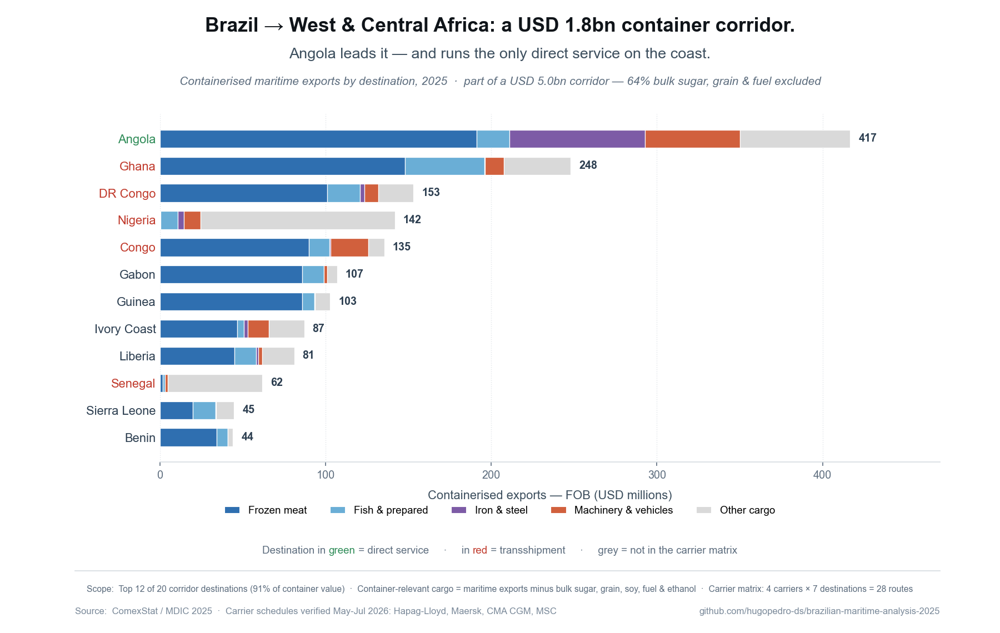

# Brazil → West & Central Atlantic Africa — a container-trade analysis



What Brazil ships to the Atlantic coast of West and Central Africa, who carries it, and why the route structure looks the way it does. Built on Brazilian customs data (ComexStat 2025) and point-to-point verification of the four largest container carriers.

---

## Companion repository

Part of a broader Brazilian maritime portfolio:

- **[brazilian-maritime-analysis-2025](https://github.com/hugopedro-ds/brazilian-maritime-analysis-2025)** — portfolio hub: port concentration (HHI), landed-cost framework, Brazil-China trade asymmetry, and the foundational ANTAQ deep-sea call analysis.

---

## The short version

In April 2026 DP World announced the "Brazil-Africa Link" — terminal investment at Santos and Luanda, backed by a 10-year agreement with Hapag-Lloyd. That raised a simple question: what does the actual trade and carrier data say about this corridor?

Three things.

**It is smaller than the headline number.** Brazil's maritime exports to the 20-country corridor were USD 5.0bn in 2025 — but 64% of that is bulk sugar, grain, soy and tanker fuel, cargo that container lines do not carry. The container-relevant corridor is **USD 1.79bn**.

**Angola leads the container trade — Nigeria does not.** Nigeria is the #1 destination by total export value (USD 1.0bn), but two-thirds of that is raw sugar moving in bulk carriers. Strip the bulk out and Nigeria drops to #4 in container terms. Angola is #1 — USD 417M, 23% of the corridor.

**One direct service in twenty-eight.** Four carriers (MSC, Maersk, CMA CGM, Hapag-Lloyd) checked against seven destinations = 28 point-to-point routes. Exactly one runs direct: Hapag-Lloyd to Luanda. The other 27 transship through a foreign hub — Tanger Med, Algeciras, Las Palmas, Antwerp.

The DP World Brazil-Africa Link builds infrastructure where the container trade is largest and the only direct service already runs. It is not a multi-carrier corridor; it is infrastructure around a single direct operator.

---

## Method

Two deliberate cuts, both done in code so they are auditable.

### Defining the corridor

"West & Central Atlantic Africa" needs a rule, not a hand-picked list. The corridor here is the **sub-Saharan Atlantic coast, from Mauritania down to Angola — 20 countries**. The data was pulled for all 56 African countries from ComexStat and then filtered to those 20; North Africa, the Indian Ocean coast and Southern Africa are excluded by geography, not by omission. The corridor is USD 5.0bn of Brazil's USD 15.2bn maritime exports to Africa (33%).

### Container-relevant cargo

ComexStat records commodity and value, not transport mode. Since the question is about container carriers, the cargo has to be separated — and the split is **inferred from the NCM (HS) chapter**:

| Treated as bulk / tanker | NCM chapter |
|---|---|
| Sugar | 17 |
| Mineral fuels | 27 |
| Cereals | 10 |
| Oilseeds | 12 |
| Ethanol | NCM 2207 |

Everything else is treated as container-relevant. This is an inference, not a measurement — see Limitations.

---

## Findings

**1. The funnel.** USD 5.0bn total → USD 3.2bn bulk/tanker (64%) → **USD 1.79bn container (36%)**.

**2. The container ranking.** Angola 417M, Ghana 248M, DR Congo 153M, Nigeria 142M, Congo 135M, Gabon 107M, Guinea 103M. The top 12 destinations carry 91% of container value (CR3 46%, CR5 61%, geographic HHI 1,076).

**3. A reefer-protein corridor.** Frozen meat alone is 53% of container cargo; meat and fish together, 54%. Brazil's container exports to this coast are, above all, frozen protein. Angola is the exception — meat is only 46% of its cargo, the rest manufactured goods, machinery and vehicles.

Two anomalies the data exposes: **Nigeria imports effectively zero frozen meat** — it has banned poultry imports since 2003 — while tiny **Benin (≈13M people) takes USD 35M of Brazilian chicken**, because Cotonou is a known entrepôt for re-export into Nigeria.

**4. The carrier matrix.** Four carriers × seven destinations, each checked point-to-point on the carrier's own booking system (May–July 2026 sailings): 28 routes, **1 direct** (Hapag-Lloyd → Luanda), 27 via transshipment. Even Hapag reaches the two Congo ports by transshipping at Luanda — Luanda works as its regional hub for Central Africa.

---

## Limitations

This analysis is built on open customs data and public schedules, and it is honest about what that does and does not support.

- **Container relevance is inferred from cargo profile, not measured.** ComexStat reports FOB value by commodity, not transport mode. The bulk/container split is a proxy based on NCM chapter and shipping practice. Some refined sugar and bagged cereals do move in containers, so the split may slightly understate container cargo.
- **Carrier routes were verified at one point in time** (May–July 2026 sailings). Rotations change.
- **The carrier matrix covers 7 of the 20 corridor destinations** — the five largest by container value, plus Senegal and Togo.
- **The Benin figure includes cargo re-exported to Nigeria**; it overstates Benin's own consumption.
- **The analysis covers exports** (Brazil → corridor); the return leg is not modelled here.

---

## Reproduce

Requires Python 3.13 with `pandas`, `numpy` and `matplotlib`.

Place the two ComexStat exports in the script's folder and run:

```
python comexstat_westafrica_analysis.py
```

The script runs in eight blocks — corridor cut, container ranking, cargo composition, reefer analysis, carrier matrix, outputs — and prints each result to the console.

---

## Files

| File | What it is |
|---|---|
| `comexstat_westafrica_analysis.py` | the analysis script |
| `exp_brasil_westafrica_pais.xlsx` | ComexStat — maritime exports by country |
| `exp_brasil_westafrica_ncm.xlsx` | ComexStat — maritime exports by country × NCM |
| `ranking_contentor_corredor_2025.csv` | container ranking, 20 destinations |
| `ranking_contentor.png` | container ranking chart |
| `grafico_westafrica_post.png` | summary chart |

---

## Author

**Hugo Pedro** — Senior maritime logistics and supply chain analytics professional. 17+ years in international shipping and multimodal logistics across Angola, Mozambique and Brazil, with extensive carrier negotiations and performance reporting experience.

**Full profile and contact:** [linkedin.com/in/hugopedro](https://www.linkedin.com/in/hugopedro/)

This repository is a public case study on Brazil's container trade with West & Central Atlantic Africa. Feedback, challenges, and corrections welcome via issues or pull requests.

**Data sources:** ComexStat / MDIC (Brazil). Carrier schedules: Hapag-Lloyd, Maersk, CMA CGM, MSC.

---

## License

MIT — see [LICENSE](LICENSE).
